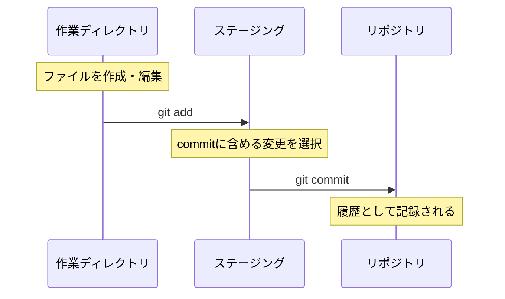
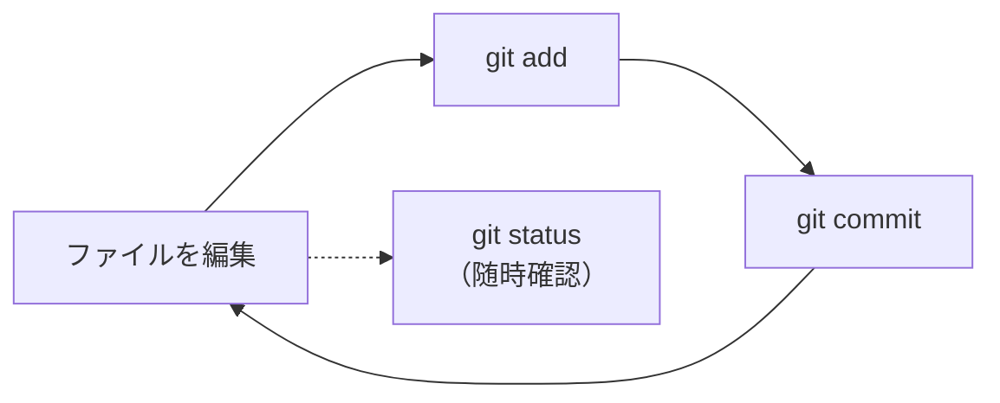

# 基本操作 ローカル編

このセクションが一番大事です。ここを理解すれば、Gitの半分は分かったも同然です。

---

## Gitの3つのエリア

Gitでは、ファイルは**3つのエリア**を移動します。この概念が全ての基本になります。


| エリア | 役割 | たとえると |
|---|---|---|
| **作業ディレクトリ** | 実際にファイルを編集する場所 | 作業机 |
| **ステージング** | 「次のcommitに含める変更」を選んで置く場所 | 発送前の梱包台 |
| **リポジトリ** | commitされた変更履歴が保存される場所 | 倉庫の棚 |

!!! tip "なぜステージングがあるの？"
    複数のファイルを変更したとき、**全部まとめてではなく一部だけ記録したい**ことがあります。
    ステージングがあることで、「この変更は記録する、この変更はまだ」と選べます。

---

## リポジトリを作る — git init

まず、バージョン管理したいフォルダでリポジトリを作成します。

```bash
mkdir my-project
cd my-project
git init
```

これで、`my-project` フォルダがGitリポジトリになりました。
（`.git` という隠しフォルダが作られ、ここに履歴が保存されます）

---

## 変更を記録する — add → commit

### 1. ファイルを作成・編集する

```bash
echo "Hello, Git!" > hello.txt
```

### 2. 状態を確認する — git status

```bash
git status
```

`hello.txt` が **Untracked files**（まだGitが追跡していないファイル）として表示されます。

### 3. ステージングに追加する — git add

```bash
git add hello.txt
```

これで `hello.txt` がステージングエリアに移動しました。
「次のcommitにこのファイルの変更を含める」という意思表示です。

!!! note "複数ファイルをまとめてaddする場合"
    ```bash
    git add file1.txt file2.txt   # 複数指定
    git add .                      # カレントディレクトリの全変更をadd
    ```

### 4. 変更を記録する — git commit

```bash
git commit -m "最初のcommit: hello.txtを追加"
```

`-m` のあとにメッセージを書きます。**何をしたかが分かるメッセージ**をつけましょう。



---

## 状態を確認する — git status / git diff

### git status

「今どういう状態か」を確認するコマンドです。**迷ったらとりあえず `git status`** と覚えてください。

```bash
git status
```

表示内容の読み方：

| 表示 | 意味 |
|---|---|
| **Changes to be committed** | ステージング済み（commitできる状態） |
| **Changes not staged for commit** | 変更はあるがステージングされていない |
| **Untracked files** | Gitがまだ追跡していない新規ファイル |

### git diff

「何が変わったか」を具体的に確認するコマンドです。

```bash
git diff              # ステージングされていない変更を表示
git diff --staged     # ステージング済みの変更を表示
```

---

## 履歴を見る — git log

これまでのcommit履歴を確認します。

```bash
git log
```

見やすく1行で表示するには：

```bash
git log --oneline
```

```
a1b2c3d 最初のcommit: hello.txtを追加
```

各commitには**ハッシュ値**（`a1b2c3d` のような英数字）が自動的に振られます。これがcommitの識別子です。

---

## ここまでの流れまとめ

日常的に繰り返す基本サイクルはこれだけです：



1. ファイルを編集する
2. `git add` でステージングに追加
3. `git commit -m "メッセージ"` で記録
4. 1に戻る

困ったら `git status` で現在地を確認。これが基本です。

---

次のセクション: [基本操作 リモート編](basic-remote.md)
