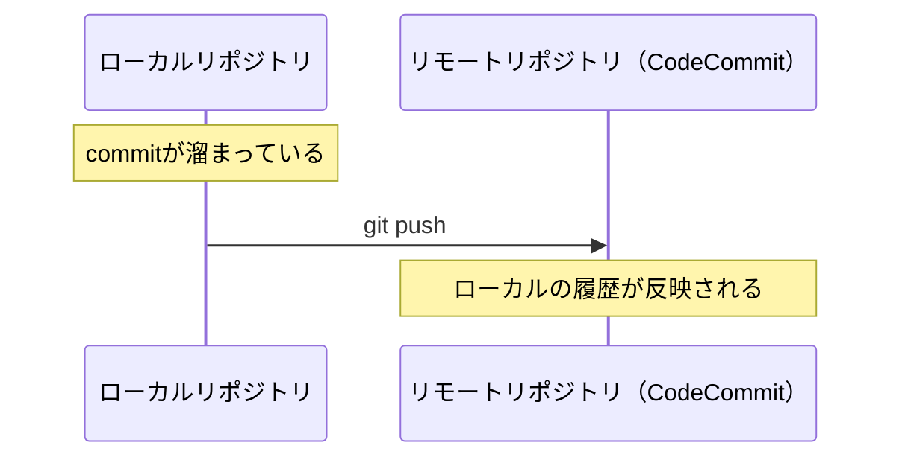
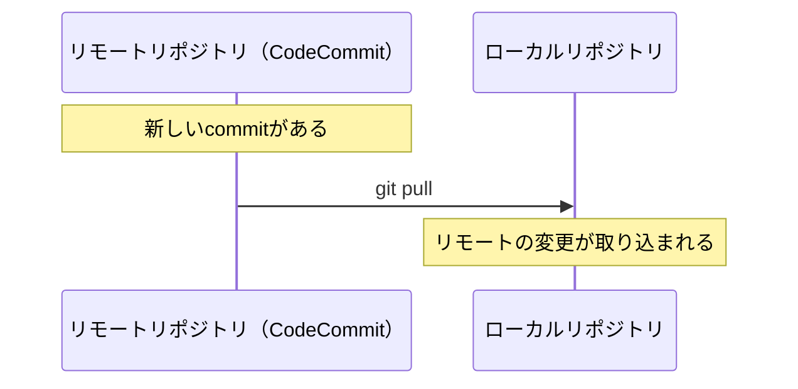
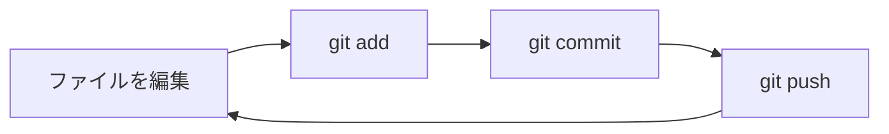

# 基本操作 リモート編

ローカルで記録した変更を、リモートリポジトリ（CodeCommit）に送る方法を学びます。

---

## なぜリモートが必要？

ローカルだけでもバージョン管理はできますが、リモートリポジトリがあると：

- **バックアップ**になる（PCが壊れても履歴が残る）
- **他の人と共有**できる（チーム開発の基盤）
- **別の端末**からでも作業を引き継げる

---

## リモートリポジトリを用意する

### CodeCommitでリポジトリを作成

AWS マネジメントコンソール、またはAWS CLIから作成できます。

```bash
aws codecommit create-repository --repository-name my-project
```

---

## 既存のローカルリポジトリとリモートを紐づける

[ローカル編](basic-local.md) で作成したリポジトリに、リモートの情報を追加します。

```bash
git remote add origin https://git-codecommit.ap-northeast-1.amazonaws.com/v1/repos/my-project
```

- **origin** はリモートリポジトリにつける名前です（慣例的に `origin` を使います）
- URLはCodeCommitのリポジトリURLに置き換えてください

設定を確認：

```bash
git remote -v
```

---

## リモートに送る — git push

ローカルのcommit履歴をリモートに送ります。

```bash
git push origin main
```



!!! tip "初回のpush"
    初回は `-u` オプションをつけると、以降は `git push` だけでOKになります。
    ```bash
    git push -u origin main
    ```

---

## リモートから取得する — git pull

リモートの変更をローカルに取り込みます。
（別の端末で作業した場合や、他の人が変更をpushした場合に使います）

```bash
git pull origin main
```



---

## リモートからコピーする — git clone

既存のリモートリポジトリを、自分のPCにコピーします。

```bash
git clone https://git-codecommit.ap-northeast-1.amazonaws.com/v1/repos/my-project
```

`clone` は以下をまとめてやってくれます：

- フォルダの作成
- `git init`
- `git remote add origin ...`
- 全履歴のダウンロード

!!! note "clone vs init"
    - **clone** — 既にリモートにリポジトリがある場合（コピーしてくる）
    - **init** — ゼロから新規にリポジトリを作る場合

---

## 日常の流れ

個人でリモートリポジトリを使う場合の基本サイクル：



1. ファイルを編集する
2. `git add` でステージングに追加
3. `git commit -m "メッセージ"` で記録
4. `git push` でリモートに送る
5. 1に戻る

!!! tip "pushのタイミング"
    commitは細かく、pushはある程度まとめて、が一つの目安です。
    「作業の区切りがついたらpush」くらいの感覚でOKです。

---

次のセクション: [やり直し・取り消し](undo.md)
