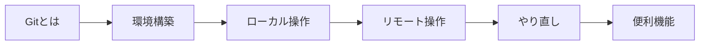

# Git Practice

**"まずは自分の作業を、自分で管理できるようになろう。"**

このサイトは、Gitによるバージョン管理を始めるための入門ガイドです。
コマンドの細かいオプションを覚える必要はありません。**概念と基本の流れ**を掴めば、あとは必要なときにCopilotに聞けばOKです。

---

## このサイトのゴール

- Gitが**何のためのツール**か分かる
- 自分の作業を **commit（記録）** して **push（共有）** できる
- 困ったときに**何を調べればいいか**分かる

---

## コンテンツ

| セクション | 内容 |
|---|---|
| [Gitとは](what-is-git.md) | バージョン管理の必要性、Git / GitHub / GitLab の違い |
| [環境構築](setup.md) | インストール、初期設定、CodeCommitへの接続 |
| [基本操作 ローカル編](basic-local.md) | init → add → commit の流れと状態遷移 |
| [基本操作 リモート編](basic-remote.md) | push / pull / clone でリモートと連携する |
| [やり直し・取り消し](undo.md) | 変更を戻すためのコマンドと使い分け |
| [便利機能・チートシート](tips.md) | .gitignore、コマンド一覧、Q&A |

---

## 学習の流れ

上から順に読めば、一通りの基礎が身につきます。

---

**Site Built with:** [Material for MkDocs](https://squidfunk.github.io/mkdocs-material/){target=_blank}
