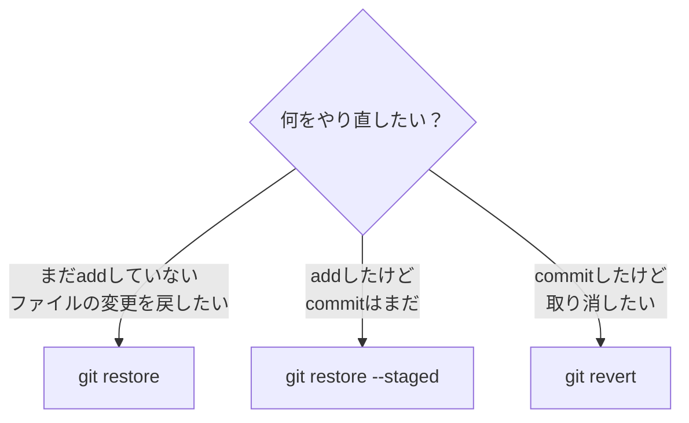
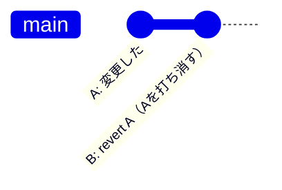

# やり直し・取り消し

「あ、間違えた」は誰にでもあります。Gitはやり直しの手段が豊富です。
ここでは、よくある場面ごとに使うコマンドを整理します。

---

## 場面別の対処法



---

## まだcommitしていない変更を戻す

### ステージング前の変更を取り消す — git restore

ファイルの編集内容を、最後のcommitの状態に戻します。

```bash
git restore hello.txt
```

!!! warning "注意"
    編集内容が完全に消えます。元に戻せません。実行前に `git diff` で内容を確認しましょう。

### ステージングを取り消す — git restore --staged

`git add` してしまったが、やっぱりステージングから外したい場合。

```bash
git restore --staged hello.txt
```

ファイルの内容はそのまま、ステージングから外れるだけです（安全な操作）。

---

## commitを取り消す — git revert

既にcommitした内容を打ち消す、新しいcommitを作ります。

```bash
git revert HEAD
```

`HEAD` は「最新のcommit」を意味します。



!!! tip "revertは「打ち消し」"
    revertは履歴を書き換えるのではなく、「元に戻す変更」を新たにcommitします。
    履歴が残るので安全です。

---

## 早見表

| やりたいこと | コマンド | 安全性 |
|---|---|---|
| 編集中のファイルを元に戻す | `git restore ファイル名` | 編集内容は消える |
| ステージングを取り消す | `git restore --staged ファイル名` | 内容はそのまま（安全） |
| 直前のcommitを打ち消す | `git revert HEAD` | 履歴が残る（安全） |

---

!!! note "resetについて"
    `git reset` というコマンドもありますが、履歴を書き換えるため扱いに注意が必要です。
    まずは上記の3つを覚えておけば十分です。
    詳しく知りたいときは「git reset revert 違い」で調べる、またはCopilotに聞いてみてください。

---

次のセクション: [便利機能・チートシート](tips.md)
