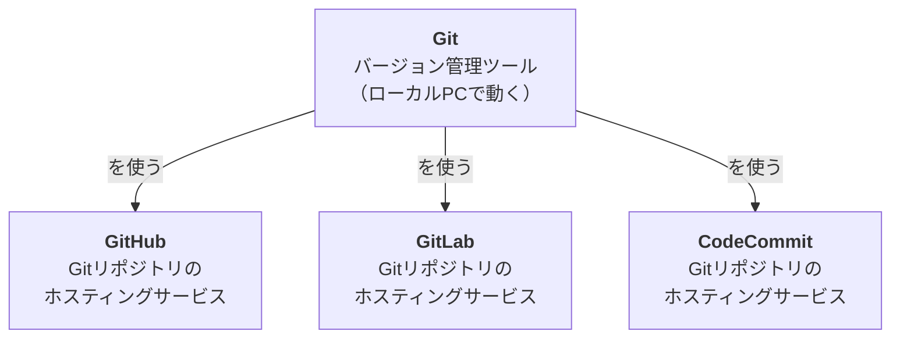
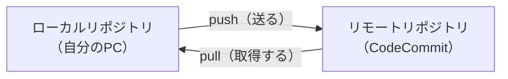

# Gitとは

## バージョン管理って何？なぜ必要？

こんな経験はないでしょうか。

- `設定ファイル_v2_最終版_本当の最終版.yaml`
- 「あの変更、いつ誰がやったんだっけ？」
- 「前の状態に戻したいけど、上書きしちゃった…」

**バージョン管理**とは、ファイルの変更履歴を記録し、いつでも過去の状態に戻せるようにする仕組みです。

バージョン管理があると：

- **いつ、誰が、何を変えたか**が全て記録される
- 過去の任意の時点に**戻せる**
- 複数人で同じファイルを編集しても**衝突を管理**できる

開発に限らず、設定ファイルやスクリプトなど**テキストで管理するもの全般**に有効です。

---

## Gitの特徴

Git は、現在最も広く使われているバージョン管理ツールです。

| 特徴 | 説明 |
|---|---|
| **分散型** | 各自のPCに履歴の完全なコピーを持つ。サーバーに繋がらなくても作業できる |
| **高速** | ほとんどの操作がローカルで完結するため、非常に速い |
| **ブランチが軽量** | 気軽に作業を分岐・統合できる（今回は扱わないが、チーム開発で重要） |

---

## Git / GitHub / GitLab / CodeCommit の違い

ここが最初につまずきやすいポイントです。

!!! warning "よくある誤解"
    「Git = GitHub」ではありません。

| | 何か | 運営 |
|---|---|---|
| **Git** | バージョン管理の**ツール**そのもの。PCにインストールして使う | オープンソース |
| **GitHub** | Gitリポジトリをクラウド上でホストする**サービス**。世界最大手 | Microsoft |
| **GitLab** | 同様のサービス。CI/CDが充実。オンプレミス版もある | GitLab社 |
| **CodeCommit** | AWSが提供する同様のサービス。AWS環境との連携が容易 | AWS |

つまり：

- **Git** = 道具（ハンマー）
- **GitHub / GitLab / CodeCommit** = 道具を使う場所（工房）

どのサービスを使っても、**Gitのコマンドや考え方は同じ**です。
このサイトではリモートリポジトリに **CodeCommit** を使いますが、学んだ知識はそのままGitHub・GitLabでも使えます。

---

## Gitで管理する「リポジトリ」とは

**リポジトリ（repository）** = Gitが変更履歴を管理しているフォルダのこと。

- **ローカルリポジトリ** — 自分のPC上にある
- **リモートリポジトリ** — サーバー（CodeCommit等）上にある

普段は自分のPCで作業して、区切りのいいところでサーバーに送る（push）、という流れになります。

---

次のセクション: [環境構築](setup.md)
